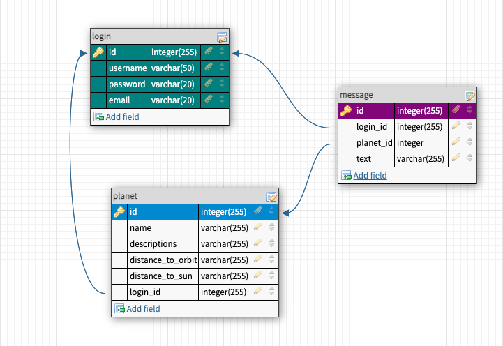

# Infinity

A learning platform with 3D/AR

## Project Description

FOR: Students  
WHO: need auditory, kinesthetic and visual style of learning
THE: Product IS: A learning platform
THAT: allows interactive learning with AR/3D
UNLIKE:  books or static text-only websites
OUR PRODUCT: helps make learning more fun and multisensory

## MVP

### Current Feature

- Log in/Sign Up page
- Display of planets from external API
- Input form to send messages to the aliens

### Future Feature

## Database Schema and API

- User flow diagram (optional design tool)
- Database schema 
- API routes plan (optional template doc)
- Full stack architecture drawing

## Setup

### Dependencies

### Database Prep

### Development

## Basic Requirements

## Notes

_This is a student project that was created at [CodeOp](http://CodeOp.tech), a full stack development bootcamp in Kuala Lumpur._

