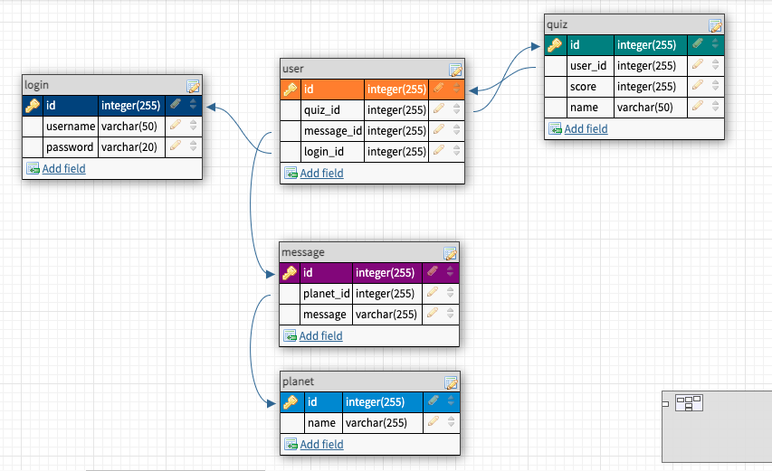

# Infinity

Do aliens exist? Experience a fun visual learning of the solar system with our Infinity App. Join us on an exciting journey to infinity and beyond! :alien::rocket::sparkles:

## Project Description

Infinity App is for students who need an auditory and visual style of learning. The product is a learning platform that allows interactive learning with 3D and quiz of the solar system. Unlike books of static text-only websites. Our product helps making learning more fun and multi-sensory (during and post pandemic season)

## MVP

### Current Features

- Landing page with Three.js
- Solar System Scope embedded with iframe build by Solar System Scope
- NASA API
- Quiz component: 8 quiz questions with multiple choice answers
- MessageForm component: Input form to send messages to the aliens
- Random Quotes Generator API
- 3D animation from Three.js

### Future Feature

- Sign Up and Log In page for both Admin/Teacher/Parent and Student
- Our own version of Solar System Scope using Three.js and Redux
- Add gamification of lessons feature
- Chatbox to interact with other users
- Admin can alter/add other science subjects

## Database Schema and API

- Database schema 

## API Routes Plan

URI | HTTP Method | Description
--- | ----------- | -----------
/users/planets | GET | Retrieve all planets
/users/planets/:id | GET | Retrieve all planets by id
/users/message | GET | Retrieve all messages submitted
/users/message | POST | Submit message into the database
/users/quiz | GET | Retrieve all quiz
/users/quiz | POST | Submit answers of the quiz
/users/user | GET | Retrieve all users

### Dependencies

- Run `npm install` in project directory. This will install server-related dependencies such as express.
- `cd client` and run `yarn install`. This will install client dependencies React App.
- You can test your client app on `http://localhost:3000`
- You can test your API in `http://localhost:5000/users`

### Database Prep

- Access the MySQL interface in your terminal by running `mysql -u root -p`
- Create a new database called `infinity`: create database `infinity`;
- Add a `.env` file to the main folder of this repository containing the MySQL authentication information for MySQL user. For example:

  ```bash
  DB_HOST=localhost
  DB_USER=root
  DB_NAME=infinity
  DB_PASS=YOURPASSWORD
  ```

  - Replace `YOURPASSWORD` with your actual password

Run `npm run migrate` in the main folder of this repository, in a new terminal window. This will create tables of the infinity database with some dummy data.

## Resources

- [MySQL Cheat Sheet](http://www.mysqltutorial.org/mysql-cheat-sheet.aspx)
- [MySQL](https://dev.mysql.com/doc/refman/8.0/en/database-use.html)
- [Fetch](https://developer.mozilla.org/en-US/docs/Web/API/Fetch_API/Using_Fetch)
- [React Documentation](https://reactjs.org/docs/getting-started.html)
- [Three.js Documentation](https://threejs.org/)

## Notes

_This is a student project that was created at [CodeOp](http://CodeOp.tech), a full stack development bootcamp in Kuala Lumpur._
